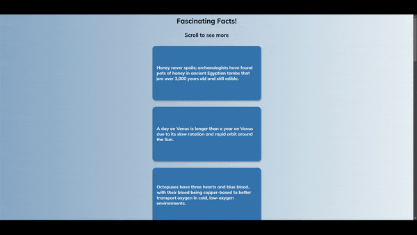

# Scroll Animations

## 🚀 Overview

This project implements smooth scroll-triggered animations to enhance user experience. The primary goal is to create engaging animations that activate as the user scrolls through the page.

### 🎯 Project Goals:
- Utilize HTML and CSS to structure and style the content.
- Leverage Flexbox for layout and alignment.
- Implement JavaScript to listen for scroll events and trigger animations.
- Apply CSS transitions to ensure smooth, visually appealing animations.

## 🛠️ Built With

- [HTML5](https://www.w3schools.com/html/)
- [CSS3](https://www.w3schools.com/css/)
- [JavaScript](https://www.w3schools.com/js/)
